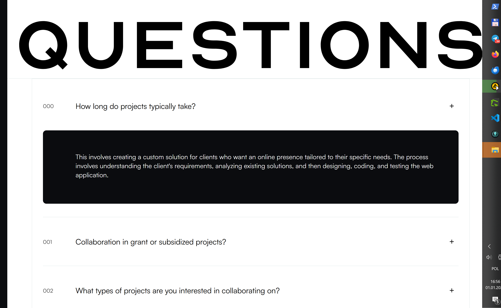

[![CC BY-NC-SA 4.0][cc-by-nc-sa-shield]][cc-by-nc-sa]

# Lorem

<!--  -->

lorem impsum.........

_Check out the live project [\_here_](https://oleg-darkdev.vercel.app/)

## Table of Contents

- [Screenshots](#screenshots)
<!-- - [Acknowledgements](#acknowledgements) -->
- [Technologies](#technologies)
- [Usage](#usage)
  - [Prerequisites](#prerequisites)
  - [Installation](#installation)
  - [Environment Variables Setup](#environment-variables-setup)
  - [Run The App](#run-the-app)
- [Support](#support)
- [License](#license)

(<a href="#readme-top">back to top</a>)

|           |      |
| :--------------------------------------------------: | :---------------------------------------------------: |
|                       _Header_                       |                    _Hero section_                     |
|   |  |
|                         :--:                         |                         :--:                          |
|                   _Skills section_                   |                  _Projects section_                   |
|  |    |
|                         :--:                         |                         :--:                          |
|                  _Speaker section_                   |                   _F.A.Q. section_                    |
|           |
|                       _Footer_                       |

(<a href="#readme-top">back to top</a>)

## 👾 Technologies

- [Typescipt](https://www.typescriptlang.org/).
- [FSD architecture](https://feature-sliced.design/ru/docs/get-started)
- [SvelteJS](https://svelte.dev/)
- [TailwindCSS](https://tailwindcss.com/)
- [SvelteKIT](https://kit.svelte.dev/)

(<a href="#readme-top">back to top</a>)

## 🖌 Creators

<table>
 <tr>
    <td align="center">
     
    <b>Oleg_darkDev</b> Product Web engineer 
    <a href="https://github.com/oleg-darkdev" target="_blank">GitHub</a>
    <a href="https://www.linkedin.com/in/oleg-darkdev" target="_blank">LinkedIn</a>
    <a href="https://oleg-darkdev.vercel.app/" target="_blank">Site</a>
    </td>
    
 </tr>
</table>

(<a href="#readme-top">back to top</a>)

## 💪🏼 Show your support

Give a ⭐️ if you like our stuff!

## 📝 License

Shield: [![CC BY-NC-SA 4.0][cc-by-nc-sa-shield]][cc-by-nc-sa]

This project is licensed under a
[Creative Commons Attribution-NonCommercial-ShareAlike 4.0 International License][cc-by-nc-sa].

[![CC BY-NC-SA 4.0][cc-by-nc-sa-image]][cc-by-nc-sa]

[cc-by-nc-sa]: http://creativecommons.org/licenses/by-nc-sa/4.0/
[cc-by-nc-sa-image]: https://licensebuttons.net/l/by-nc-sa/4.0/88x31.png
[cc-by-nc-sa-shield]: https://img.shields.io/badge/License-CC%20BY--NC--SA%204.0-lightgrey.svg

<!-- This project is  licensed. -->

(<a href="#readme-top">back to top</a>)

